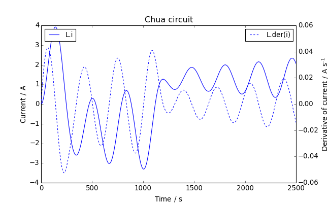

ModelicaRes
-----------

[ModelicaRes] is an open-source tool to manage [Modelica] simulations, interpret
results, and create publishable figures.  It is currently possible to

- Auto-generate simulation scripts,
- Run model executables with varying parameters,
- Browse data,
- Perform custom calculations, and
- Produce various plots and diagrams.

The figures are generated via [matplotlib], which
offers a rich set of plotting routines.  [ModelicaRes] includes convenient
functions to automatically pre-format and label some figures, like xy plots,
Bode and Nyquist plots, and Sankey diagrams.  [ModelicaRes] can be scripted or
run from a [Python] interpreter with math and matrix functions from [NumPy].

For more information, please see the [main project site] or the [doc](doc)
folder of the package for the full documentation and many examples.  The
development site is https://github.com/kdavies4/modelicares.

### Installation

An installable copy of this package can be downloaded from the
[main project site] or the
[PyPI page](http://pypi.python.org/pypi/ModelicaRes).  To install the package,
first download and extract it.  Then run the set up script
([setup.py](setup.py)) from the base folder.  On Windows, use the following
command:

    python setup.py install

On Linux, use:

    sudo python setup.py install

The [matplotlibrc](matplotlibrc) file in the base folder has some recommended
revisions to [matplotlib]'s defaults.  To use it, copy or move the file to the
working directory or [matplotlib]'s configuration directory.  See
http://matplotlib.org/users/customizing.html for details.

### Credits

The main author is Kevin Davies.  Kevin Bandy also helped in the development of
this package.  Third-party code has been included
from Jason Grout
([ArrowLine](http://old.nabble.com/Arrows-using-Line2D-and-shortening-lines-td19104579.html)
class), Jason Heeris
([efficient base-10 logarithm](http://www.mail-archive.com/matplotlib-users@lists.sourceforge.net/msg14433.html)),
Richard Murray
([python-control](http://sourceforge.net/apps/mediawiki/python-control)), and
Joerg Raedler (method to expand a [Modelica] variable tree - from [DyMat]).

### License terms

[ModelicaRes] is published under the terms of the BSD license (see
[LICENSE.txt](LICENSE.txt)).  Please share any modifications you make
(preferably on a Github fork from https://github.com/kdavies4/ModelicaRes) so
that others may benefit from your work.

### See also

The [pysimulator], [BuildingsPy], [DyMat], and [awesim] projects provide related
[Python] modules.  [pysimulator] includes an elaborate GUI and supports the
Functional Model Interface (FMI).  [BuildingsPy] has a **Tester** class that can
be used for unit testing.  [DyMat] has functions to export [Modelica] simulation
data to comma separated values (CSV), [Gnuplot](http://www.gnuplot.info/),
MATLAB&reg;, and
[Network Common Data Form (netCDF)](http://www.unidata.ucar.edu/software/netcdf/).
[awesim] provides tools to help run simulation experiments and organize the
results.

[main project site]: http://kdavies4.github.io/ModelicaRes/
[ModelicaRes]: http://kdavies4.github.io/ModelicaRes/
[Modelica]: http://www.modelica.org
[Python]: http://www.python.org
[NumPy]: http://numpy.scipy.org
[matplotlib]: http://www.matplotlib.org
[DyMat]: http://www.j-raedler.de/projects/dymat/
[pysimulator]: https://code.google.com/p/pysimulator/
[BuildingsPy]: http://simulationresearch.lbl.gov/modelica/buildingspy/
[awesim]: https://github.com/saroele/awesim
