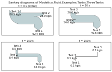

ModelicaRes
-----------

**Python utilities to set up and analyze Modelica simulation experiments**

ModelicaRes is a free, open-source tool to conveniently manage [Modelica]
simulations, interpret results, and create publishable figures in [Python].  It
is possible to
- auto-generate simulation scripts,
- browse data,
- perform custom calculations,
- produce various plots and diagrams, and
- export data to various formats via [pandas].

The figures are generated via [matplotlib], which offers a rich set of plotting
routines.  ModelicaRes includes functions to automatically pre-format and
label some figures, like xy plots, Bode and Nyquist plots, and Sankey diagrams.
[odelicaRes can be scripted or used in an interactive [Python] session with math
and matrix functions from [NumPy].

Please see the tutorial, which is available as an
[IPython notebook](examples/tutorial.ipynb) or online as a
[static page](http://nbviewer.ipython.org/github/kdavies4/ModelicaRes/blob/master/examples/tutorial.ipynb).
For the full documentation and many more examples, see the [main website].

### Installation

The easiest way to install this package is to use [pip]:

    pip install modelicares

On Linux, it may be necessary to have root privileges:

    sudo pip install modelicares

Another way is to download and extract a copy of the package The [main
website] and the [release branch at GitHub] have copies with built
documentation and compiled examples.  The copy on the [PyPI page] only has the
files to install the package, build the documentation, and execute the examples.
Once you have a copy, run the following command from the base folder:

    python setup.py install

Or, on Linux:

    sudo python setup.py install

Some of the required packages may not install automatically.
- The [SciPy] stack, including [matplotlib] and [pandas], can be installed
  according to the instructions at http://www.scipy.org/install.html.
- [PyQt] can be downloaded from
  http://www.riverbankcomputing.co.uk/software/pyqt/download.
- [wxPython] can be downloaded from http://www.wxpython.org/download.php.
  However, it is only required for the
  [variable browser](http://kdavies4.github.io/ModelicaRes/simres.html#modelicares.simres.SimRes.browse).

The [matplotlibrc](matplotlibrc) file has some recommended revisions to
[matplotlib]'s defaults.  To use it, copy it to the working directory or
[matplotlib]'s configuration directory.  See
http://matplotlib.org/users/customizing.html for details.

### Credits

The main author is Kevin Davies.  Code has been included from:
- Richard Murray
  ([python-control](http://sourceforge.net/apps/mediawiki/python-control)),
- Joerg Raedler (method to expand a [Modelica] variable tree---from [DyMat]),
- Jason Grout
  ([ArrowLine](http://old.nabble.com/Arrows-using-Line2D-and-shortening-lines-td19104579.html)
  class), and
- Jason Heeris
  ([efficient base-10 logarithm](http://www.mail-archive.com/matplotlib-users@lists.sourceforge.net/msg14433.html)).

Suggestions and bug fixes have been provided by Arnout Aertgeerts, Kevin Bandy,
Thomas Beutlich, Martin Sjölund, Mike Tiller, and Michael Wetter.

### License terms and development

ModelicaRes is published under a [BSD-compatible license](LICENSE.txt).  Please
share any modifications you make (preferably as a pull request to the ``master``
branch of the [GitHub repository](https://github.com/kdavies4/ModelicaRes)) in
order to help others.  If you find a bug, please
[report it](https://github.com/kdavies4/ModelicaRes/issues/new).  If you have
suggestions, please
[share them](https://github.com/kdavies4/ModelicaRes/wiki/Suggestions).

### See also

- [awesim]\: helps run simulation experiments and organize results
- [BuildingsPy]\: supports unit testing
- [DyMat]\: exports [Modelica] simulation data to comma-separated values ([CSV]),
  [Gnuplot], MATLAB&reg;, and Network Common Data Form ([netCDF])
- [PyFMI]\: tools to work with models through the Functional Mock-Up Interface
  ([FMI]) standard
- [PySimulator]\: elaborate GUI; supports [FMI]

[main website]: http://kdavies4.github.io/ModelicaRes
[PyPI page]: http://pypi.python.org/pypi/ModelicaRes

[Modelica]: http://www.modelica.org
[Python]: http://www.python.org
[pandas]: http://pandas.pydata.org
[matplotlib]: http://www.matplotlib.org
[NumPy]: http://numpy.scipy.org
[SciPy]: http://www.scipy.org/index.html
[PyQt4]: http://www.riverbankcomputing.co.uk/software/pyqt
[wxPython]: http://www.wxpython.org
[pip]: https://pypi.python.org/pypi/pip
[awesim]: https://github.com/saroele/awesim
[BuildingsPy]: http://simulationresearch.lbl.gov/modelica/buildingspy
[DyMat]: http://www.j-raedler.de/projects/dymat
[PyFMI]: https://pypi.python.org/pypi/PyFMI
[PySimulator]: https://github.com/PySimulator/PySimulator
[Gnuplot]: http://www.gnuplot.info
[CSV]: http://en.wikipedia.org/wiki/Comma-separated_values
[netCDF]: http://www.unidata.ucar.edu/software/netcdf
[FMI]: https://www.fmi-standard.org
[python-control]: http://sourceforge.net/apps/mediawiki/python-control
[ArrowLine]: http://old.nabble.com/Arrows-using-Line2D-and-shortening-lines-td19104579.html
[efficient base-10 logarithm]: http://www.mail-archive.com/matplotlib-users@lists.sourceforge.net/msg14433.html
